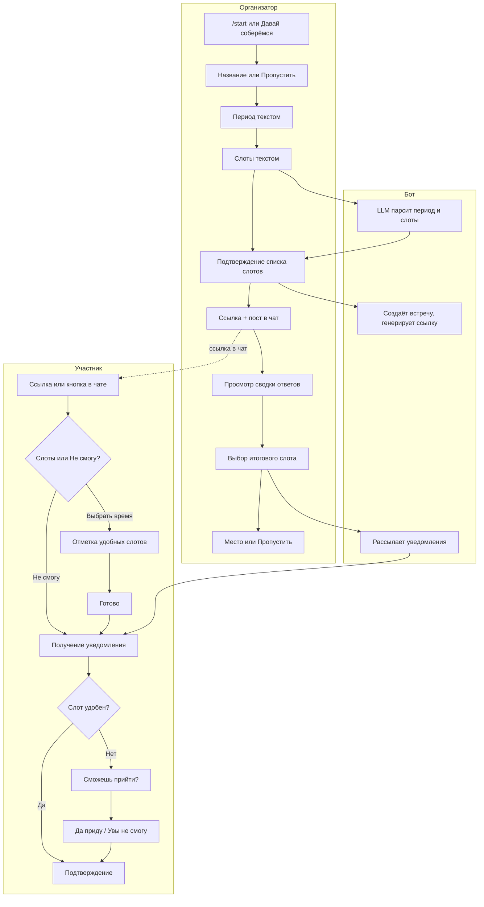

# План реализации Telegram-бота Вайб

Пошаговый план реализации бота для согласования встреч. MVP: локальный запуск, хранение в сессиях (в памяти), без баз данных. Токены бота и LLM в `05. Development/.env`. Поэтапная реализация от обязательного минимума до откладываемых фич.

Основа: [BOT_FLOW_MVP.md](../03.%20Scenarios/BOT_FLOW_MVP.md), [BOT_DEV_SUMMARY.md](BOT_DEV_SUMMARY.md), [BOT_VOICE_AND_TEXTS.md](../03.%20Scenarios/BOT_VOICE_AND_TEXTS.md).

---

## User Flow: схема взаимодействия

**Кратко по ролям:**

| Роль | Действия |
|------|----------|
| **Организатор** | Старт → название → период (текст, LLM) → слоты (текст, LLM) → подтверждение → ссылка → сводка ответов → выбор слота → место → рассылка |
| **Участник** | Ссылка → отметка удобных слотов или «Не смогу» → Готово → уведомление → при необходимости «Сможешь прийти?» → подтверждение |
| **Бот** | LLM-парсинг, хранение в сессиях, генерация ссылки, рассылка |

---

## 1. Подготовка окружения

**Цель:** бот запускается локально, читает оба токена из `05. Development/.env`.

- Python 3.9+, зависимости: `pip install -r requirements.txt`
- Токены в `.env`: `TELEGRAM_BOT_TOKEN`, `OPENAI_API_KEY`. Файл в `.gitignore`.
- В `config.py`: читать `BOT_TOKEN` или `TELEGRAM_BOT_TOKEN`; добавить `OPENAI_API_KEY`
- Запуск: `python main.py` из корня проекта

---

## 2. Хранение в сессиях (вместо БД для MVP)

- `meetings: dict[str, dict]` — ключ = meeting_id. Значение: title, period, slots, status, creator_user_id, chat_id, chosen_slot_id, place.
- `participants: dict[tuple[str, int], dict]` — ключ = (meeting_id, user_id). Значение: status, chosen_slot_ids, pending_confirm.
- При перезапуске бота данные теряются — для MVP допускается.

---

## 3. FSM для организатора

Шаги: название → период → слоты → подтверждение → приглашение.

1. **Старт** — `/start` или «Давай соберёмся!» → состояние `title`
2. **Название** — текст или «Пропустить» → `period`
3. **Период** — парсинг (dateparser + LLM) → `slots`
4. **Слоты** — парсинг → подтверждение → сохранение встречи, генерация ссылки
5. **Приглашение** — ссылка организатору; в группе — пост с кнопкой

---

## 4. Парсинг периода и слотов

**Гибрид:** сначала dateparser (поддержка «25 февраля», «завтра 15:00», «16.02»), затем LLM (OpenAI) как fallback.

---

## 5. Поток участника

- Deep link `t.me/bot?start=meeting_<id>`
- Слоты с inline-кнопками (toggle «удобно»), «Увы, не смогу», «Готово»
- Сохранение в сессию: status, chosen_slot_ids

---

## 6. Просмотр ответов организатором

- Организатор по ссылке видит сводку: кто ответил, кто отказался, количество по каждому слоту
- Кнопки «Встречаемся [дата, время]!» → выбор слота → ввод места → рассылка

---

## 7. Рассылка уведомлений

- Отметившим слот — сразу подтверждение
- Не отметившим — «Сможешь прийти?» + «Да, приду!» / «Увы, не смогу»

---

## 8. Групповой чат

- Сохранять chat_id при создании из группы
- После создания — пост в чат с кнопкой «Ответить на приглашение»

---

## 9. Этапы реализации

| Этап | Задачи |
|------|--------|
| **1. Обязательно** | Токены, сессии, FSM организатора, LLM-парсинг, ссылка, ответ участника |
| **2. Основной** | Сводка, выбор слота, место, рассылка, «Сможешь прийти?» |
| **3. Позже** | SQLite, «Мои встречи», напоминания |

**Порядок:** окружение → сессии → FSM + парсинг → ссылка и приглашение → участник → сводка и выбор → рассылка.

---

## 10. Что не входит в MVP

- Напоминания не ответившим
- Редактирование слотов до первых ответов
- Отмена/перенос встречи
- Слот «можно подвинуть» и предложение своего слота участником

---

## Связанные документы

| Документ | Назначение |
|----------|------------|
| [BOT_FLOW_MVP.md](../03.%20Scenarios/BOT_FLOW_MVP.md) | Пошаговый сценарий диалогов |
| [BOT_DEV_SUMMARY.md](BOT_DEV_SUMMARY.md) | Сущности, действия бота, алгоритм слотов |
| [BOT_VOICE_AND_TEXTS.md](../03.%20Scenarios/BOT_VOICE_AND_TEXTS.md) | Тексты и тон сообщений |
| [IMPLEMENTATION.md](IMPLEMENTATION.md) | Документация текущей реализации |
